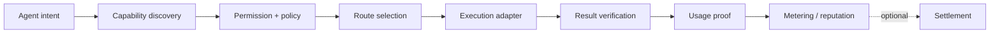

# DeTool

**A capability and data-access layer for AI agents.**

> Status: **design / pre-alpha**. The repository defines a public protocol sketch, schemas, and synthetic examples. It does not yet provide a live registry, payment network, or production router.

## The problem

An agent can call a tool without understanding whether that capability is authentic, allowed, current, safe for this user, or verifiably completed. Tool catalogs alone do not answer:

- Who operates this capability?
- What data and permissions does it require?
- What output or side effect will it produce?
- How can usage be proven and disputed?
- Which route should the agent choose under cost, latency, trust, or policy constraints?
- How can open-network reputation or billing be added without making it a branding claim before it works?

## Thesis

**Agents need a trustable market for capabilities, not just longer tool lists.**

DeTool separates capability identity, policy decisions, route selection, execution evidence, and settlement so each layer can evolve independently.

## Proposed flow



## Core contracts

| Contract | Purpose |
| --- | --- |
| Capability manifest | Identity, operator, input/output contract, side effects, data classes, and verification method |
| Access decision | Explicit allow/deny/challenge decision with policy version and reason |
| Usage proof | Request digest, result digest, timestamps, verifier, and dispute window |

The first reference version treats billing, reputation, and Web3 settlement as optional adapters. Their presence in the design is not a claim that a token, market, or decentralized network exists today.

## Repository map

```text
.
├── README.md
├── docs/
│   └── architecture.md
├── schemas/
│   ├── access-decision.json
│   ├── capability.json
│   └── usage-proof.json
└── examples/
    └── synthetic-capability.json
```

## Inspect the contracts

```bash
python3 -m json.tool schemas/capability.json >/dev/null
python3 -m json.tool schemas/access-decision.json >/dev/null
python3 -m json.tool schemas/usage-proof.json >/dev/null
python3 -m json.tool examples/synthetic-capability.json >/dev/null
```

## Roadmap

- [x] Capability, access-decision, and usage-proof schemas
- [x] Synthetic capability manifest
- [ ] Local registry and schema validator
- [ ] Deterministic policy evaluator
- [ ] Multi-provider route selection prototype
- [ ] Result verifier adapters
- [ ] Signed usage-proof experiment
- [ ] Optional billing and open-network reputation adapters

## X content reservoir

1. Why tool discovery is not capability trust
2. What an agent should know before it invokes a side effect
3. The difference between execution logs and usage proofs
4. Routing across cost, latency, reliability, and policy
5. Where permissions belong in an agent stack
6. What Web3 can add only after local verification works

## Security boundary

Examples are synthetic. Never commit API keys, provider credentials, private endpoints, customer data, browser sessions, or payment identifiers.

## License

MIT — see [`LICENSE`](./LICENSE).

