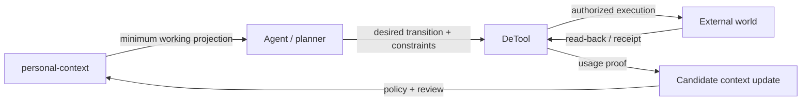
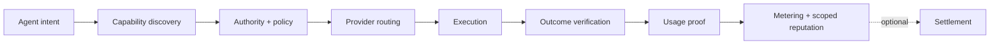

# DeTool

**An engineering-led capability execution system for AI agents.**

> Track: **execution system** · Status: **building / pre-alpha**. This repository contains public contracts, architecture notes, a minimal executable scaffold, tests, and synthetic examples. It does not yet operate a live registry, provider network, payment rail, or production router.

## The thesis

Models can increasingly internalize instructions, planning patterns, and thin API wrappers. They cannot internalize a successful external action.

```text
no application  → apply_job()        → application_id
no meeting      → schedule_meeting() → calendar_event_id
no order        → order_food()       → order_id
asset A         → swap()             → asset B + receipt
```

**The durable unit is not a tool package. It is a maintained capability that produces a verifiable external state transition.**

DeTool is intended to resolve that capability across API, MCP, browser automation, local software, an agent service, or a human-assisted workflow without coupling the caller to the implementation.

## Two agent boundaries

DeTool and [`personal-context`](https://github.com/outisseus/personal-context) describe opposite sides of one agent loop.

| Boundary | Question | Canonical output |
| --- | --- | --- |
| `personal-context` | What does the agent know, from which evidence, at what time, under which write policy? | a minimal, source-backed working projection |
| `detool` | What can the agent verifiably do in the external world, through whom, under which authority and constraints? | a verified usage proof for an external state transition |



Personal Context does not grant authority merely because a preference or credential reference is remembered. DeTool does not retain unrelated personal history. A verified action returns evidence; it does not write directly into long-term context.

See [`docs/personal-context-integration.md`](./docs/personal-context-integration.md).

## The problem

A catalog can tell an agent that a tool exists. It does not establish:

- whether the capability works now;
- who operates and maintains it;
- what authority, identity, data, or session it requires;
- what external side effect it will attempt;
- what counts as successful completion;
- how the outcome can be read back, verified, disputed, and billed;
- which provider best satisfies reliability, latency, price, policy, and proof constraints.

The bottleneck is often not reasoning. It is crossing the model boundary and changing external state safely.

## Core object: a capability endpoint

```yaml
capability: apply_job
provider: synthetic-provider
execution_mode: browser
success_condition: APPLICATION_SUBMITTED
proof: confirmation_id
requires:
  - user_identity
  - resume
  - authorized_session
pricing: charge_on_verified_success
failure_policy: no_verified_outcome_no_charge
```

The caller should not need to care whether the provider uses OpenAPI, MCP, browser automation, RPC, local code, or a maintained human fallback. Those are execution transports, not the product boundary.

## Proposed flow



## What belongs in the network

| Capability class | Examples | Why the model cannot absorb it |
| --- | --- | --- |
| Proprietary knowledge or data | underwriting rules, enterprise databases, licensed market data | the information or entitlement remains external |
| Authorized functions | transfer funds, write CRM state, place an order | identity and permission are required for a real side effect |
| Public external functions | book travel, reserve inventory, schedule a meeting | current availability and confirmation exist outside the model |
| Maintained browser actions | submit an application, complete a legacy workflow | the interface changes and reliability requires ongoing maintenance |

Static procedural knowledge and thin wrappers are expected to commoditize. Maintained execution, authorization, availability, and proof are not.

## What is the moat—and what is replaceable

The protocol and schemas are copyable. The durable network advantage appears only when real capability use compounds.

### Own: the enduring core

- **Capability identity and outcome semantics:** a stable description of the requested before/after state, side effect, authority, and success evidence.
- **Maintained provider graph:** who can perform each action now, in which environment, under which constraints.
- **Reliability history:** scoped success rate, latency, maintenance freshness, disputes, and verifier quality by provider and capability version.
- **Outcome proof and chargeability:** normalized evidence that distinguishes accepted requests from verified completion.
- **Routing and demand graph:** accumulated knowledge of which provider works for which context, constraint set, and failure mode.

### Abstract: necessary but replaceable dependencies

- MCP, OpenAPI, GraphQL, browser automation, RPC, local programs, agent services, and human workflows;
- OAuth, enterprise IAM, wallet signatures, session credentials, and approval interfaces;
- payment rails, token settlement, invoice providers, and reputation transports;
- model planners, agent runtimes, queues, databases, and observability stacks.

DeTool should be able to replace any of these without losing capability identity, reliability history, usage proofs, disputes, or routing evidence.

### Borrow now: pre-alpha compromises

- JSON contracts stand in for a running registry and resolver;
- declared service levels stand in for measured rolling reliability;
- synthetic browser execution stands in for maintained real providers;
- manual policy reasoning stands in for a deterministic evaluator;
- optional settlement is specified before real billing and dispute handling exist.

The roadmap should progressively replace these compromises while preserving the enduring core above.

## Reliability is the economic primitive

DeTool should reward verified outcomes, not uploaded packages.

```text
provider value
≈ verified demand
× maintained availability
× scoped success rate
× uniqueness
× proof quality
```

An adapter that worked once is not a durable capability. Reliability must be measured against a capability version, execution environment, verifier, and time window.

## Core contracts

| Contract | Purpose |
| --- | --- |
| Capability manifest | Operator, action, input/output contract, execution mode, state transition, permissions, verification, and service-level claims |
| Access decision | Explicit allow/deny/challenge result with policy version, constraints, and reason |
| Usage proof | Request/result digests, before/after evidence, confirmation identifier, verifier, outcome, and chargeability |

Billing, reputation, and open-network settlement remain optional adapters. Web3 may be useful for portable proof or settlement; it is not required for DeTool's core execution model.

## Adjacent validation: Pieverse

[Pieverse](https://www.pieverse.io/) is a useful adjacent implementation: its cross-runtime Skill Store, protected wallet-signed actions, and A2A commerce stack support the view that capability discovery alone is insufficient.

DeTool deliberately keeps a different boundary: outcome-first, transport-neutral, and not crypto-native by default. See [`docs/pieverse-research-note.md`](./docs/pieverse-research-note.md).

## Repository map

```text
.
├── README.md
├── docs/
│   ├── architecture.md
│   ├── personal-context-integration.md
│   └── pieverse-research-note.md
├── src/detool/
│   ├── cli.py
│   ├── contracts.py
│   └── proofs.py
├── tests/
│   └── test_contracts.py
├── schemas/
│   ├── access-decision.json
│   ├── capability.json
│   └── usage-proof.json
├── examples/
│   └── synthetic-capability.json
├── Makefile
└── pyproject.toml
```

## Inspect the contracts

```bash
python3 -m json.tool schemas/capability.json >/dev/null
python3 -m json.tool schemas/access-decision.json >/dev/null
python3 -m json.tool schemas/usage-proof.json >/dev/null
python3 -m json.tool examples/synthetic-capability.json >/dev/null
make test
make check
make example
```

## Roadmap

- [x] Capability, access-decision, and usage-proof schemas
- [x] Synthetic external-action manifest
- [x] Personal Context ↔ DeTool boundary and proof handoff
- [x] Transport-neutral architecture boundary
- [x] Minimal local contract loader, CLI, proof fixture, and tests
- [ ] JSON Schema-backed registry service and persistent resolver
- [ ] Deterministic policy evaluator
- [ ] Multi-provider route selection prototype
- [ ] Read-back and receipt verifier adapters
- [ ] Rolling reliability and dispute model
- [ ] Signed usage-proof experiment
- [ ] Optional billing and open-network settlement adapters

## Public-work boundary

Examples are synthetic. Never commit API keys, provider credentials, private endpoints, customer data, browser sessions, payment identifiers, or real-world authorization artifacts.

## License

MIT — see [`LICENSE`](./LICENSE).
